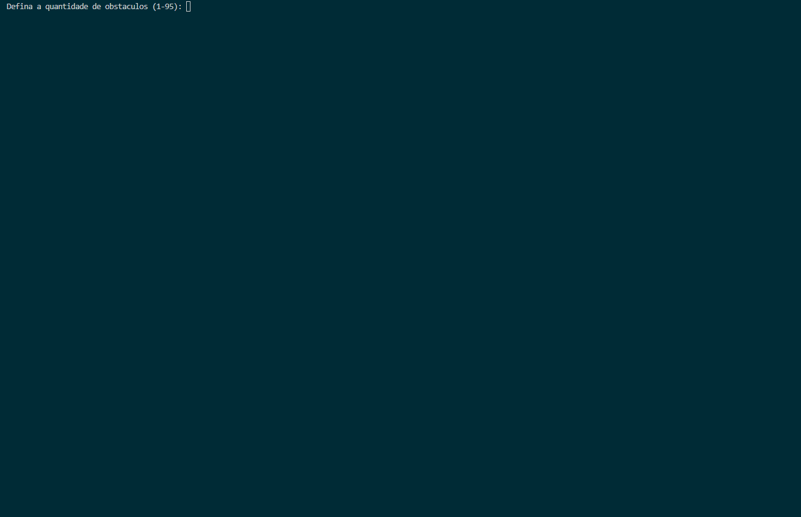

# 🐛 Simulação de Minhoca em C

> Uma simulação de console desenvolvida em C que implementa um passeio aleatório de uma "minhoca" em um tabuleiro 2D, com regras de colisão e gerenciamento de estado.


## Sobre o Projeto
Este projeto foi desenvolvido como trabalho para a disciplina de **Construção de Algoritmos** na UERJ. O objetivo era criar uma simulação em C de uma minhoca se movendo aleatoriamente em um tabuleiro, seguindo um conjunto de regras específicas. A aplicação é executada inteiramente no terminal e demonstra conceitos fundamentais de estruturas de dados, algoritmos e gerenciamento de memória em uma linguagem de baixo nível.

## Funcionalidades
- **Ambiente Configurável:** O usuário define o número de obstáculos, a posição inicial da minhoca e a quantidade de movimentos da simulação.
- **Movimento Aleatório Inteligente:** A minhoca seleciona uma direção válida (não pode colidir com paredes, obstáculos ou com seu próprio corpo) de forma aleatória a cada passo.
- **Simulação Visual:** O estado do tabuleiro é impresso no console a cada movimento, criando um efeito de animação.
- **Análise Final:** Ao término da simulação, o programa exibe um relatório com o número de casas visitadas e não visitadas pela minhoca.
- **Validação de Entrada:** A interface de console é robusta, validando as entradas do usuário para prevenir erros de execução.

## Tecnologias e Conceitos
- **Linguagem:** C (Padrão C99)
- **Estruturas de Dados:** `structs` (para representar pontos e a minhoca), Arrays 2D, `enum`.
- **Gerenciamento de Memória:** Ponteiros, Alocação em Pilha (*Stack*), *Variable Length Arrays* (VLAs).
- **Algoritmos:** Movimento "Follow-the-leader", *Fisher-Yates Shuffle* para randomização de direções, Validação de Colisão.

##  Como Executar
O projeto consiste em um único arquivo `main.c` e pode ser compilado com qualquer compilador C padrão.

**Pré-requisitos:**
* Um compilador C (como GCC ou Clang) instalado e configurado no seu PATH.

**Compilação:**
```bash
# Navegue até a pasta do projeto
cd diretorio-do-projeto

# Compile o programa
gcc main.c -o minhoca
```

